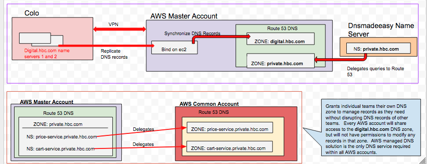

# DNS solution within AWS accounts.

This readme will cover the Ansible and Bash scripts intended to automate creation of a secondary BIND server in AWS and utilizing that server as part of an overall DNS solution within the HBC Tech AWS accounts.

Sections:

[**Goals and Solution**](#goals-and-solution)

[**Prerequisites**](#prereqs)

[**Create Bind Servers**](#create-servers)

[**Bind Server Details**](#server-details)

[**Known Issues**](#known-issues)

[**Utility Scripts**](#utility-scripts)

[**Required Network Changes**](#network-prereqs)


<a name="goals-and-solution"></a>
## Goals and Solution
Given the de-centralization of teams and full lifecycle ownership of a service by the development team, we are in need of a DNS solution that reflects this organizational structure.

### Criterion

1. Ensure hosts in the digital.hbc.com DNS zone can be resolved in all AWS accounts hosting microservices.
2. Support rapid, programmatic changes to DNS records used to locate microservice instances.
3. Isolate development team DNS changes to avoid one team disrupting the existing DNS records of another.
4. Provide a DNS solution that can privately (internal HBC network)  and publicly (Internet routable) expose microservices

### Solution
The solution leans heavily on Route 53 service.

1. Replicate the **digital.hbc.com** zone into a Route 53 private zone and associate that zone with all VPCs allowing Amazon DNS to resolve digital.hbc.com domains. 

   * In the AWS master account, install a secondary DNS server that is a slave to the digital.hbc.com master name servers.
	* Create a private zone (non-internet routable) in Route 53 for the digital.hbc.com domain and synchronize the zone with DNS records from the secondary DNS server.
	* Associate the Route 53 **digital.hbc.com**  zone with every VPC in each AWS account.

2. Create a second level domain delegated from HBCs registrar directly to AWS.  Allows all service related DNS to be managed by the same AWS resolver used for digital.hbc.com named.  
    * In the AWS master account, create a Route 53 public zone (internet routable with firewall restrictions to only allow connectivity from HBC network) named **private.hbc.com**
	* Create a Name Server record in the corporate registrar DNSMADEEASY to delegate traffic for **private.hbc.com** to the AWS Route 53 name servers.

Visual representation of solution:



**OF NOTE:** All file paths are relative to this document.

<a name="prereqs"></a>
## Prerequisites
1. Ansible 2.3 with boto3. A script to create the virtualenv can be found [**below**](#ansible-virtualenv)
2. AWS cli installed and configured with Master account credentials havingfull ec2 privileges. Credentials must be set in the environment variables: ```AWS_SECRET_ACCESS_KEY AWS_ACCESS_KEY_ID```
3. User with access to **hd1pbk01lx.digital.hbc.com** and sudo privileges to change into the *rbackup* user.
4. **digital.hbc.com** nameservers must contain A records for the IPs and hostnames of the target bind servers.  
5. All required network routes and firewall openings are listed [**here**](#network-prereqs)
6. Primary DNS server configured to allow zone transfers to both secondary bind servers
7. SSH key pair for EC2 instances is registered in AWS
8. EC2 instance profile with full EC2 api permissions and s3 bucket read permissions


<a name="create-servers"></a>
## Create Bind Servers
1. Two hosts have been pre-defined and configured with network routes:  **hd1pamz01lx.digital.hbc.com/172.26.88.5** and **hd1pamz02lx.digital.hbc.com/172.26.93.5**.
2. Configure control file in s3 bucket ```s3://hbc-configs/bind-server/route53-synch-host``` by specifying which host should synchronize zone updates with Route 53.
3. Verify the host properties in inventory file ```hosts_vars/bindservers``` and the shared variables in ```group_vars/bindservers.yml```
4. Execute the following Ansible playbook:
```ansible-playbook -v create-bind-ami.yml -u ec2-user --private-key <path-to-private-key-uploaded-to-aws> -i host_vars/bindservers```

This will create two autoscale groups named **BIND-SERVER-172.26.88.5** and **BIND-SERVER-172.26.93.5** with once instance each. The hostname entry in the **route53-synch-host** will determine which of the instances synchronize with route 53, but both will replicate the master nameserver.

You can ssh into the instances by hostname using your digital Active Directory user/pass.  Sudo to root when logged in and verify the bind server is transferring records by tailing the log file **/var/log/named/xfer-in.log**    You should see successfull record transfer logs that look like ```27-Jun-2017 13:36:38.756 transfer of 'hbc-digital-1.cns.digital.hbc.com/IN' from 192.168.6.201#53: Transfer completed: 16 messages, 7842 records, 478105 bytes, 0.075 secs (6374733 bytes/sec)```

If you see excessive logs like ```27-Jun-2017 15:55:47.421 transfer of '44.32.10.in-addr.arpa/IN' from 192.168.6.201#53: failed while receiving responses: REFUSED``` there is an issue with the Primary nameserver and an SA will be needed to debug.


<a name="server-details"></a>
## Bind Server Details

### Deployment Model
The BIND server on hosts **hd1pamz01lx** and **hd1pamz02lx** are each deployed in an autoscale group containing one instance for high availability.  Additionally, each autoscale group must be deployed to a different availability zone.  A pre-configured ENI exists for each BIND server AMI and is attached when the instance starts.  USER_DATA initialization does not work on Red Hat, so a systemd service performs the initialization and starts the nsnotifyd daemon to watch DNS record changes and synchronize them with Route 53.  Each AMI has host specific networking configurations, so a single AMI cannot be simply used for each autoscale group.
**OF NOTE**:  Due to the use of an AMI, the automatic patching from the Red Hat Satellite server will only last as long as the patched instance is running.  Patches will be applied when the AMI is rebuilt again.

### Route 53 DNS Record Synchronization
**digital.hbc.com** NOTIFY messages are received by both the secondary BIND servers and a [**nsnotifyd**](http://dotat.at/prog/nsnotifyd/) daemon that listens on the same UDP ports as the secondary bind servers.  The daemon will send information about the zone change to a shell script that determines whether to synchronize records with the Route 53 private zone that is also named **digital.hbc.com**.  The **nsnotifyd** daemon is started by the systemd service **nsnotify-synch.service** which is defined in the unit file ```roles/create-bind-ami/files/nsnotify-synch.service```.  Synchronization is handled by the script ```roles/create-bind-ami/files/nsnotify/nsnotify-synch.sh```

### Binding ENI on Red Hat
Red Hat does not automatically support enabling a non-primary network interface when it is attached.  A second route table needs to be created and a routing rule needs to be added to route traffic to the interface based on the IP assigned to the interface.  See file ```roles/create-bind-ami/templates/attach-static-eni.yml``` for changes needed.

### Log file for Route 53 synch process
The nsnotifyd logs the NOTIFY messages and determination of a record change in /var/log/messages   The same file contains the output of the nsnotify-synch.sh script that performs the Route 53 synchronization.  Logs for the BIND server can be found in **/var/log/named/**

### Handling named.conf changes
Zones in the master nameserver and configuration of the BIND server are stored in the file ```roles/create-bind-ami/files/etc/named.conf```.  If this file is updated, the autoscale group, launch configuration and AMI must be built.  The playbook ```delete-asg-lc-ami.yml``` will tear these down by host.  Then update the named.conf and execute the playbook ```create-bind-ami.yml``` as stated in [Create Bind Servers](#create-servers)


### Ansible Playbooks
1. ```ansible-playbook -v create-bind-ami.yml -u ec2-user --private-key <path-to-private-key-uploaded-to-aws> -i host_vars/bindservers```
2. Creates the EC2 instance, Security Group, ENI with static IP, configures the EC2 for digital AD logins, registers the EC2 with Satellite and adds the hostname to the inventory list of all digital.hbc.com servers managed by the System Administrators for mass updates (such as when the Satellite registration certificates need to be updated)

3. ```ansible-playbook -v delete-asg-lc-ami.yml -u ec2-user``` 
Deletes the Autoscale Group, Launch Confguration and AMI for a given host.

4. ```ansible-playbook -v create-asg.yml -u ec2-user -i host_vars/bindservers```
Creates the Launch Configuration and Autoscale Group for the given hosts.  Requires the AMI to exist and only one AMI per host exists.  

<a name="known-issues"></a>
## Known Issues
1. Sometimes when creating more than one host at a time in the **create-bind-ami.yml** playbook, one of the hosts will fail to create the AMI (an odd error that the EC2 instance is not reachable with ssh). It is suggested that a single server is created at one time using either the **--limit** option on *ansible playbook* or commenting out a server in the **host_vars/bindservers** inventory file.
2. Sometimes Ansible fails to find the AMI for a host when creating the Autoscale group and Launch configuration.  If the AMI was successfully created, then you can execute the **create-asg.yml** playbook to create them.

<a name="utility-scripts"></a>
## Utility Scripts

1. Associate a hosted zone with a VPC in same or other account allowing EC2 instances in the VPC to look up any host in the zone through AWS DNS.  Execute the script for the usage description and arguments:  
```vpc-hosted-zone-association-request.sh```
2. Peer two VPCs across accounts.  Execute the script for the usage description and arguments: ```vpc-peer-request.sh```
3. <a name="ansible-virtualenv"></a>Create Ansible Environment (requires pip): install pip and execute: ```./install_ansible-2.3_virtualenv.sh```  Then execute ```source ~/virtualenv/ansible/bin/activate``` before running ansible.  Type **deactivate** to exit the virtualenv.


<a name="network-prereqs"></a>
## Appendix A - Required Network Changes
**OF NOTE**  'AWS Networks' is pre-defined network object representing all VPC cidrs in all AWS accounts

```
FROM 192.168.7.29(hd1pbk01lx) TO AWS NETWORK ON PORT 22/SSH  53/DNS  80/HTTP 443/HTTPS  161/SNMP (ADMIN jump bock for emergencies)

FROM hd1mng01lx  TO  AWS Networks  on 22/SSH  53/DNS  80/HTTP 443/HTTPS  161/SNMP  (Monitoring)

FROM ALL Servers on these AWS Networks TO  HD1PAD01MS/HD1PAD02MS  on the following PORTS
Destination -    Protocol      - Service
53          -    TCP and UDP   - DNS
389         -    TCP and UDP   - LDAP
636         -    TCP           - LDAPS
88          -    TCP and UDP   - Kerberos
464         -    TCP and UDP   - Kerberos change/set password (kadmin)
3268        - 	 LDAP Global Catalog (If "id_provider = ad" is being used)
3269        -    TCP           - LDAP Global Catalog SSL
123         -    UDP           - NTP (Optional)

FROM AWS Networks to hd1pst01lx  PORT 80 and 443
Port    Protocol    	  Service    	Required for
53    	 TCP and UDP    	DNS    		Queries to the Satellite's integrated DNS service
67    	 UDP    			DHCP    	For Client provisioning from the integrated Capsule
69    	 UDP    			TFTP    	Downloading PXE boot image files from the integrated Capsule
80    	 TCP    			HTTP    	Anaconda, yum, for obtaining Katello certificates, templates, and for downloading iPXE firmware
443      TCP    			HTTPS    	Subscription Management Services, yum, Telemetry Services, and for connection to the Katello Agent
5647     TCP    			amqp    	The Katello agent to communicate with the Satellite's Qpid dispatch router```
