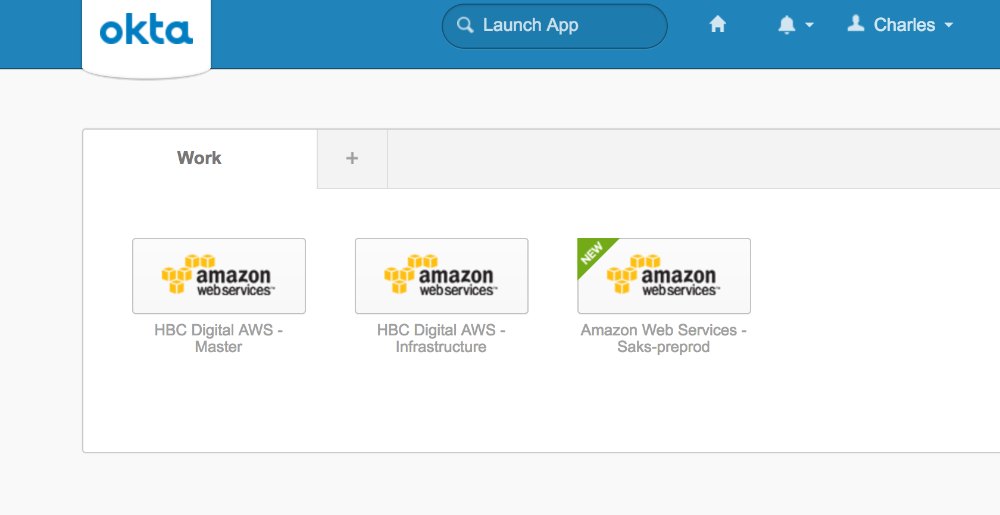
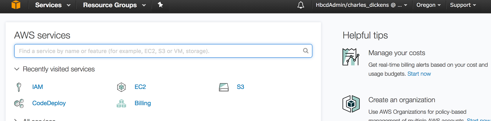

# Verify Access to AWS Console and CLI

After an AWS application has been configured in Okta and one or more people assigned to the application, verify AWS console and cli access in the following ways.


## Console Access
As the person assigned to the application, log into Okta using your Digital Active Directory account. In your dashboard view select the new application that was added (in this example it is "Amazon Web Services - Saks-preprod").  Click the application and you will be logged into the AWS console.






Each AWS account will be configured as an application in Okta, so switching account will require you to select the appropriate application in your Okta dashboard.


## CLI Access
We will use the tool developed by Gilt colleague Andrey Kartashov.  In summary, the tool handles asserting your identify against Okta and submitting the results of that assertion (along with the roles assigned in Okta) to the AWS Security Token Service to request temporary access/secret keys.  The tool has an option to continuously refresh keys before they expire in their 60 minute lifesapn. 
The tool can be found at:

https://github.com/gilt/okta-aws-login/

Install the latest release of the tool with 

```
curl -L https://raw.githubusercontent.com/gilt/okta-aws-login/master/install | /bin/bash
```

Review the config requirements and command line options in the README.md

Create the file *$HOME/.okta-aws-login.json* with the format defining each application available to you:

```
{
  "saml": [
    {
      "org": "<okta-orgname>",
      "aws_profile": "<awscli credentials file profile name>",
      "okta_aws_account_id": "application-sigon-identifier"
    },
        {
      "default": true,
      "org": "<okta-orgname>",
      "aws_profile": "<awscli credentials file profile name>",
      "okta_aws_account_id": "application-sigon-identifier"
    }
  ]
}

```	

* **org** Is the Okta organization, which is 'S5A' in our examples
* **aws_profile** Indicates the profile name in your awscli credentials  file where your temporary access/secret keys will be written.
* **default** Indicates the default configuration if one is not specified on the command line of the tool.  The value of the command line option *--aws-profile* must match the 'aws_profile' attribute.
* **okta aws account_id** The SAML Single Sign On identifier for the application.  This value can be found in the SAML metadata XML for the application.  Log into Okta as an admin and select the application.  Click the *Sign On* section.  Then click the *Identity Provider* metadata to download the SAML XML.


Look for the element **md:SingleSignOnService.Location** which will have the format:

```
Location="https://<Okta-Org>.okta.com/app/amazon_aws/<okta-aws-account-id>/sso/saml"

Ex:
Location="https://s5a.okta.com/app/amazon_aws/exk2ihnm2c2L9CR3n1t7/sso/saml"
```

An example from a metadata XML:

```
<md:SingleSignOnService Binding="urn:oasis:names:tc:SAML:2.0:bindings:HTTP-POST" Location="https://s5a.okta.com/app/amazon_aws/exk2ihnm2c2L9CR3n1t7/sso/saml"/><md:SingleSignOnService Binding="urn:oasis:names:tc:SAML:2.0:bindings:HTTP-Redirect" Location="https://s5a.okta.com/app/amazon_aws/exk2ihnm2c2L9CR3n1t7/sso/saml"/></md:IDPSSODescriptor></md:EntityDescriptor>
```

The following is okta-aws-login.json that contains configurations for the **HBC Digital AWS - Infrastructure** and **HBC Digital AWS - Master** applications in the **S5A** Okta organization:

```
{
  "saml": [
    {
      "default": true,
      "org": "s5a",
      "aws_profile": "master",
      "okta_aws_account_id": "exk2eqbv6toxv3HKB1t7"
    },
    {
      "org": "s5a",
      "aws_profile": "infra",
      "okta_aws_account_id": "exk2i4zbhzND7x8ux1t7"
    }
  ]
}
``` 

The following are the command line options creating keys for both accounts.  Note that the user has been assigned multiple roles in the master account.

```
: okta-aws-login --user charles_dickens -p infra
Please enter Okta password >
[Info] Using AWS profiles "infra" :| [] @(main:Main src/Main.hs:179:5)
[Info] Refreshing AWS session ... @(main:Main src/Main.hs:63:5)
[Info] Refreshed AWS session. @(main:Main src/Main.hs:76:5)
~: aws --profile infra iam list-account-aliases
{
    "AccountAliases": [
        "hbcinfrastructure"
    ]
}

okta-aws-login --user charles_dickens -p master
Please enter Okta password >
[Info] Using AWS profiles "master" :| [] @(main:Main src/Main.hs:179:5)
[Info] Refreshing AWS session ... @(main:Main src/Main.hs:63:5)
[0] arn:aws:iam::403224047997:role/HbcdAdmin
[1] arn:aws:iam::403224047997:role/HbcdUser
Please choose> 0

[Info] Refreshed AWS session. @(main:Main src/Main.hs:76:5)
~: aws --profile master iam list-account-aliases
{
    "AccountAliases": [
        "hbcdigitalmaster"
    ]
}
```


