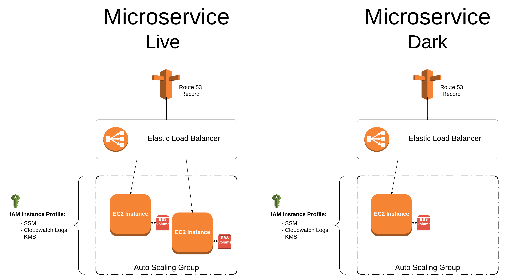

# Canary

This module provisions and deploys a service using the [canary technique](https://martinfowler.com/bliki/CanaryRelease.html). The underlining infrastructure provisioned includes two [microservice](../microservice) modules. One for the `live` service and one for the `dark` service.

An example of how to use this module can be seen in [toggle-service](https://github.com/saksdirect/toggle-service/tree/master/infrastructure/terraform/toggles).

## Usage

1. Source the canary module to your terraform file. See [toggle-service](https://github.com/saksdirect/toggle-service/blob/master/infrastructure/terraform/toggles/main.tf) for an example.
2. Set the required canary input variables -- you may do this by using a [terraform.tfvars](https://www.terraform.io/intro/getting-started/variables.html#from-a-file) file or provide these directly your `main.tf` file.

        terraform.tfvars:
        * app_name            | Name of application (ex: "hello-world")
        * app_port            | Port to run application that is exposed in docker image (ex: "8080") 
        * ping_path           | Endpoint for application health check (ex: "/_internal_/ping")
        * live_image          | Docker image for live container, including version
        * dark_image          | Docker image for dark container, including version
        * asg_min             | Minimum instances for app autoscaling group (ex: "1")
        * asg_max             | Maximum instances for app autoscaling group (ex: "2")
        * asg_desired         | Desired instances for app autoscaling group (ex: "1")
        * hbc_banner          | Banner deployed within (ex: multi-tenant, bay, saks...)
        * hbc_group           | HBC Tech group name (ex: back-office, path-to-purchase, search)
        * hbc_env             | Environment executing within (i.e. production or pre-production)
        * lb_security_group   | Security group for load balancer (ex: "sg-xxxxxxxx")
        * app_security_group  | Security group for application (ex: "sg-xxxxxxxx")
        * shared_kms_key      | KMS Key for shared parameters stored in AWS Parameter Store 
        * subnet_ids          | List of subnet ids for application autoscaling group (ex: [ "subnet-xxxxxxxx", "subnet-xxxxxxxx" ])
        * hosted_zone         | Route 53 hosted zone where the service endpoint will be created (ex: hbccommon.private.hbc.com)
        * key_name            | Name of EC2 kekypair for ssh access to provisioned instances (ex: "super-secret-key")
        * instance_type       | Type of EC2 instance to use for each container (ex: "t2.micro")
        
      Reference [variables.tf](variables.tf) for the list of canary input variables as well as a short description of them.

3. Run `terraform plan` to see what infrastructure will be provisioned.
4. Deploy your canary stack by executing `terraform apply`.

## Tests

See the canary [test](../../tests/canary) directory.