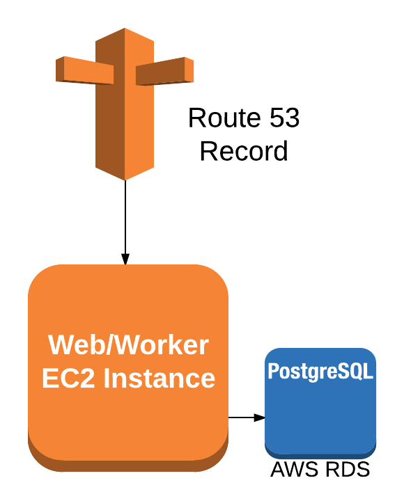

# Concourse

This module provisions the infrastructure needed to deploy [Concourse CI](https://concourse.ci/). The infrastructure that will be created in AWS can be seen below:

An example of how to use this module can be seen in the [canary module](../canary).

## Usage

1. Source the concourse module to your terraform file. See our [aws-ref-arch pipeline](../../pipeline) for an example.
2. Set the required concourse input variables -- you may do this by using a [terraform.tfvars](https://www.terraform.io/intro/getting-started/variables.html#from-a-file) file or provide these directly your `main.tf` file.

        terraform.tfvars:
        * team_name             | Name of team who is provisioning this stack (ex: "rogue-squadron")   
        * hbc_banner            | Banner deployed within (ex: multi-tenant, bay, saks...)
        * hbc_group             | HBC Tech group name (ex: back-office, path-to-purchase, search)    
        * hbc_env               | Environment executing within (i.e. production or pre-production)  
        * concourse_username    | Concourse CI admin username
        * concourse_password    | Concourse CI admin password             
        * db_username           | Concourse Postgres DB username      
        * db_password           | Concourse Postgres DB password      
        * worker_volume_size    | Size of worker volume in GB (ex: "10")             
        * instance_type         | Type of EC2 instance for web/worker (ex: "t2.small")        
        * db_instance_class     | Type of RDS DB instance (ex: "db.t2.micro")            
        * db_storage_size       | Storage size in GB for postgres RDS (ex: "10")          
        * iam_instance_profile  | Instance profile for application (ex: "Temp_Concourse_Role")               
        * security_group_id     | Security group id for concourse stack (ex: "sg-47df2e36")            
        * subnet_id             | Subnet id  for web/worker EC2 instance (ex: "subnet-1f359c33")
        * db_subnet_group       | Name of postgres RDS DB subnet group (ex: "temp_postgres")
        * key_name              | AWS Keypair for ssh access to web/worker EC2 instance 
        
      Reference [variables.tf](variables.tf) for the list of concourse input variables as well as a short description of them.

3. Run `terraform plan` to see what infrastructure will be provisioned.
4. Deploy your concourse by executing `terraform apply`.

## Tests

See the concourse [test](../../tests/concourse) directory.