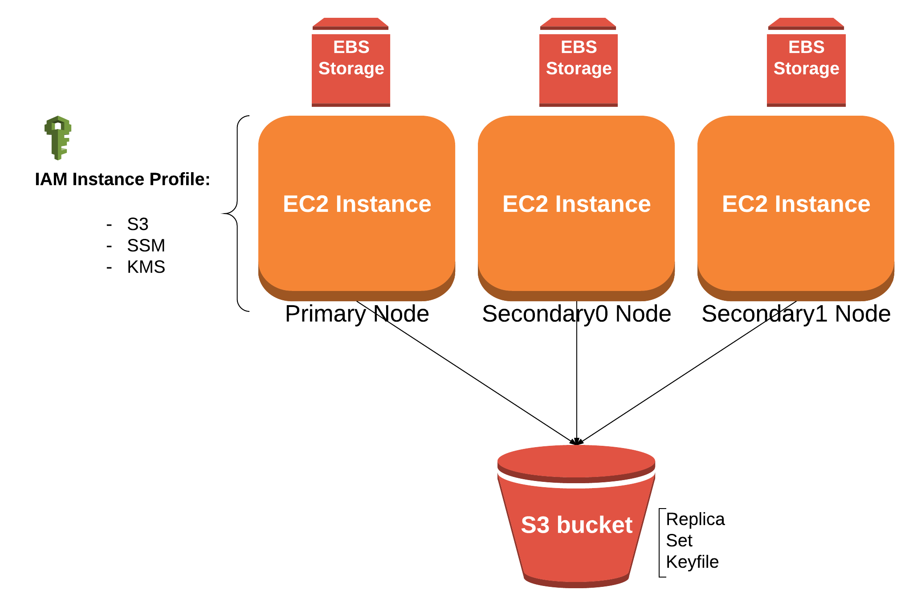

# MongoDB Replica Set

This module provisions a three member [MongoDB replica set](https://docs.mongodb.com/manual/tutorial/deploy-replica-set/). The replia set will consist of three `nodes` which are each separate AWS EC2 instances that write data to a mounted AWS EBS block device. 

An example of how to use this module can be seen in [toggle-service](https://github.com/saksdirect/toggle-service/blob/master/infrastructure/terraform/mongo).

## Usage

1. Create a [keyfile](https://docs.mongodb.com/manual/tutorial/deploy-replica-set-with-keyfile-access-control/#create-a-keyfile) for your mongo replica set
2. Source the mongo module to your terraform file. See [toggle-service](https://github.com/saksdirect/toggle-service/blob/master/infrastructure/terraform/mongo/main.tf) for an example.
3. Set the required mongo input variables -- you may do this by using a [terraform.tfvars](https://www.terraform.io/intro/getting-started/variables.html#from-a-file) file or provide these directly your `main.tf` file.

        terraform.tfvars:
        * key_name                 | Name of EC2 ssh keypair to launch MongoDB instances with
        * mongo_keyfile            | Absolute path to keyfile for mongo replica set
        * admin_username           | Username for Mongo admin account
        * admin_password_key       | Key used to get password for Mongo admin account from AWS parameter store
        * replica_set_name         | Name of MongoDB replica set
        * db_name                  | Database name for app
        * parameter_key_namespace  | Namespace for keys stored in AWS parameter store
        * security_group           | Name of security group to launch MongoDB instances with
        * subnet_id                | Subnet to deploy Mongo nodes
        * db_username              | Username for app db
        * db_password_key          | Key used to get password for app db from AWS parameter store
        * hbc_banner               | Banner deployed within (ex: multi-tenant, bay, saks...)
        * hbc_group                | HBC Tech group name (ex: back-office, path-to-purchase, search)
        * hbc_env                  | Environment executing within (i.e. production or pre-production)
        
      Reference [variables.tf](variables.tf) for the list of mongo input variables as well as a short description of them.

4. Run `terraform plan` to see what infrastructure will be provisioned.
5. Provision an empty replica set with `terraform apply`.

**Note:** It will take around a minute to configure the Mongo replica set after the EC2 instances have been provisioned

## Tests

See the mongo [test](../../tests/mongo) directory.
